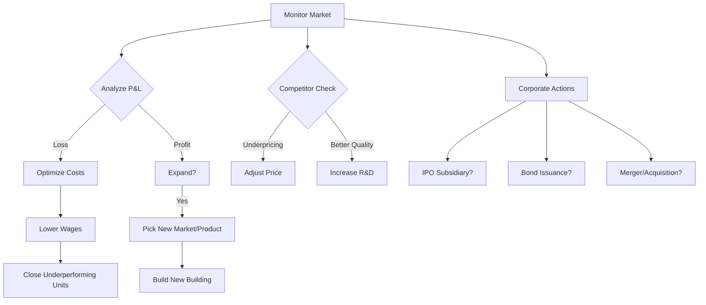

# 06 — AI Competitors

This document specifies the behavior of AI corporations and their "CEO" decision-making logic.

---

## 1. AI Archetypes

AI CEOs are assigned archetypes that dictate their long-term strategies and risk tolerance.

| Archetype | Description | Aggression | Primary Focus |
|-----------|-------------|------------|---------------|
| **Aggressive Expander** | Rapidly opens new retail/factories, often with debt. | High | Growth / Market Share |
| **Tech Innovator** | Heavy R&D spending, focuses on high-tech products. | Medium | Product Quality / Tech Leadership |
| **Price Warrior** | Undercuts competitors, prioritizes mass-market volume. | High | Low Cost / Sales Volume |
| **Diversified Giant** | Spreads into multiple disconnected industries. | Low | Stability / Diversification |
| **Niche Specialist** | Dominates one specific product class (e.g., Apparel). | Medium | Niche Loyalty |
| **Corporate Raider** | Focuses on mergers, acquisitions, and restructuring. | High | Stock Market / M&A |

---

## 2. The Decision Loop

Every AI company ticks on a "Strategic Evaluation" interval (e.g., every 30 days).



## 2.1 Delegation System (Subsidiary DLC)
AI hierarchy mirrors the player's potential delegation:
- **CEO (Strategic):** High-level capital allocation, M&As, and entering new industries.
- **COO (Operational):** Managing internal 3x3 units, link optimization, and individual building profitability.
- **CMO (Marketing):** Handling brand strategy, media spend, and price competition.

---

## 3. Location Analysis (Building Placement)

AI evaluates tiles for new buildings using a weighted score:

```
Score = (Traffic * 0.4) + (ProximityToSuppliers * 0.2) - (CompetitiveSaturation * 0.3) - (LandCost * 0.1)
```

- **Retail:** Prioritizes high human traffic density.
- **Factory:** Prioritizes low city wages and short distances to raw material mines/farms.
- **Mines:** Always builds on the highest quality discovered resource deposit.

---

## 4. Product Selection Algorithm

When looking for new revenue streams:

1. **Scan all Product Classes.**
2. **Calculate "Profitability Potential":**
   ```
   Potential = (MarketDemand / TotalCitySupply) * (AvgCityPrice - EstimatedManufactureCost)
   ```
3. **Pick Highest Potential** (filtered by Archetype focus).
4. **Acquire Tech:** If AI doesn't have the recipe tech, it invests in R&D or buys a license (if DLC enabled).

---

## 5. Financial Management

AI follows rules for capital allocation:

- **Cash Padding:** Always attempts to keep at least 3 months of operating expenses in cash.
- **Debt Ceiling:** Will stop borrowing if `Debt-to-Equity > 0.6`.
- **Stock Market:** If stock is undervalued (low P/E), AI will prefer Buybacks. If overvalued, it will issue shares to fund expansion.

---

## 6. Competitor Response (Tactical AI)

If the Player enters the AI's "Turf" (same product in same city):

| Player Action | AI Response |
|---------------|-------------|
| **Aggressive Pricing** | AI lowers price to match (up to a 5% margin floor). |
| **Better Marketing** | AI increases ad spending in that city. |
| **Superior Quality** | AI shifts R&D priority to that product class. |
| **Supply Chain Disruption** | If AI bought raw materials from Player and Player cuts them off, AI immediately hunts for a new supplier or builds its own mine. |

---

## 7. AI Self-Education & Evolution (Anti-Gravity Protocol)

The AI in **MacroMogul** is designed to be **dynamic and self-learning**. It does not simply follow a static script; it evolves based on the player's behavior and global market trends.

### 7.1 Success Inheritance
- **Trait Mining:** The system tracks which AI archetypes are most successful in the current seed. Successors (newly spawned AI) inherit weighted traits from the "winners".
- **Anti-Monopoly Logic:** If the Player (or a dominant AI) controls >70% of a market, the "Insurgent" AI behavior is triggered. These AI companies focus 100% on disruption—leveraging niche products or extreme price wars to break the monopoly.

### 7.2 Adaptive Balancing
- **Mogul difficulty:** At higher levels, AI CEOs gain the ability to "collude" (form trade blocks) or innovate 20% faster to maintain the "enjoyment-to-challenge" ratio based on player skill metrics.

---

## 8. Difficulty Tuning & Evolution

| Level | AI Aggression | Starting Capital | Evolution Rate |
|-------|---------------|------------------|----------------|
| Easy | 40% | 50% of Player | Static (No Skill Tracking) |
| Normal | 100% | 100% of Player | Adaptive (Matches Player Growth) |
| Hard | 150% | 200% of Player | Predictive (AI anticipates player moves) |
| **Mogul** | 200% | 500% of Player | Hyper-Evolution (Aggressive M&A, Trade Blocks) |

---

## 8. Acceptance Criteria

- [ ] AI companies build production chains autonomously.
- [ ] AI responds to player pricing/marketing changes.
- [ ] AI manages cash/debt levels without going bankrupt instantly.
- [ ] Multiple archetypes coexist in the same game world.
- [ ] AI evaluates location suitability correctly using overlays.
